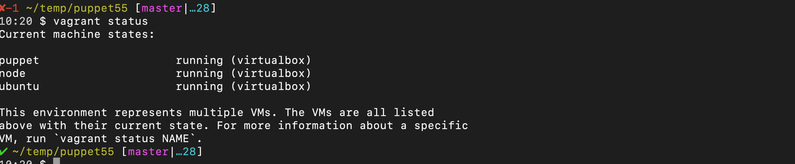

# Introduction to building Puppet test environment using vagrant & virtualbox

I frequently write puppet modules so i always have to have a working puppet test environment with multiple nodes. while the instructions for setting up puppet server and agent are no way difficult but  require some amount of manual work, which is not much fun and overtime virtual machines running on laptop go unstable due to no. of reasons, including me trying crazy things :-) . So everytime i start a new project it consumes an hour or so before i can even start being productive, this lead me to write  **_Vagrantfile_** file to automate the process.

Using the **_Vagrantfile_** we can quickly spin up three VMs [ a puppet master & two nodes running puppet agent ] with a simple command, it still takes fewer minutes but far less compared to previous lead time.

Advantages include,

1. Fast vm provisioning
2. Repeatable process
3. Accuracy 

## Installation

Win/Mac/Linux ( any flavour) 

Install following packages 

1. [Virtual box](https://www.virtualbox.org/)
2. [Vagrant](https://www.vagrantup.com/)
3. [Git](someurl)

* Launch CMD/Terminal/Console on your system and run `vagrant init`, if this works we are good to proceed to next step.

* Let's begin setting up puppet test environment,
  1. run `git clone https://github.com/faintdream/puppet55.git` 
  2.  `cd puppe55`
  3.  `vagrant up`

Screenshots for reference

The new puppet test environment is up , but `puppet agent` running on the VMs are still not configured to talk to `puppet master/puppetserver`

* Establish HTTPS connectivity between all servers running `puppet agent` to server running `puppet master/puppetserver` 

Commands to run on each server running `puppet agent`

1. ` vagrant ssh <vm name>`

2. `sudo su`

3. `puppet agent -t`

   This will generate a client side ssl and will be used by `puppetserver` to authenticate the vm as a valid node.

   

   

   

Commands to run on server running `puppet master/puppetserver`

1. `puppet cert sign --all`

   this will sign all pending certificate requests, that means all nodes can talk to `puppetserver` 

   

A working puppet test environment is now ready  !

###### Bonus points if you get around this

To apply an exisitng `apache` module on `node` run  ` puppet agent -t `  as `root`, this should install `apache`  on the server.

1. `vagrant ssh node`
2. `sudo su `
3. `puppet agent -t`

Note: during bootstrap we downloaded several sample modules i created for demo purpose via `r10k` on `puppetserver` , if you are curious how the modules got deployed on `puppetserver` please look through `Vagrantfile` as well as `Puppetfile` under  [r10k-site](https://github.com/faintdream/r10k-site).

Vagrant command reference:

| Commands                   | Description                                                  |
| -------------------------- | ------------------------------------------------------------ |
| vagrant up                 | Creates new VMs as well as launches existing VMs             |
| vagrant ssh  **<vm name>** | Lets you ssh to newly built VM, no password required and user can `sudo su` |
| vagrant halt               | Shutdown existing VMs                                        |
| vagrant provision          | runs post install steps/script mentioned in _Vagrantfile_    |
| vagrant destroy            | Deletes virtual machines and any disks associated with them  |
| vagrant status             | shows the status of VMs built via *Vagrantfile* in current directory |

### Troubleshooting

* if you get below certificate error, it means that certificate is not working, we need to delete it as instructed in error output from the server running `puppet agent` as well as from the `puppet master/puppetserver`
* 